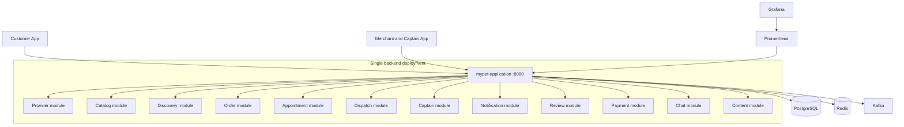

# MyPet — Pet Care & Store Marketplace

MyPet is an on-demand pet supplies, veterinary, grooming and delivery
marketplace. The backend is a **Spring Boot + Kotlin modular monolith** with
twelve bounded contexts packaged into one production process. The customer and
merchant/captain mobile applications are built with Expo React Native.

## Architecture



### Runtime properties

- **One backend process:** `mypet-application` on port `8080`.
- **Embedded API edge:** JWT validation, identity propagation, CORS, rate
  limiting, request IDs and idempotency are handled inside the application.
- **One database pool:** all existing domain schemas and twelve Flyway history
  tables are retained.
- **In-process module calls:** synchronous cross-domain work uses typed module
  interfaces rather than HTTP.
- **Durable asynchronous work:** Kafka remains infrastructure for outbox jobs
  and projections.
- **One scheduler owner:** scheduled jobs use a shared JDBC ShedLock provider.
- **Rollback available:** the previous distributed topology is retained only as
  a temporary rollback stack.

## Repository structure

```text
MyPet/
├── apps/
│   ├── customer-app/
│   └── merchant-captain-app/
├── backend/
│   ├── mypet-application/       # Production executable
│   ├── provider-service/        # Provider bounded-context source module
│   ├── catalog-service/         # Catalog bounded-context source module
│   ├── discovery-service/
│   ├── order-service/
│   ├── appointment-service/
│   ├── dispatch-service/
│   ├── captain-service/
│   ├── notification-service/
│   ├── review-service/
│   ├── payment-service/
│   ├── chat-service/
│   ├── content-service/
│   └── common/
├── infra/
│   ├── docker-compose.yml               # PostgreSQL, Redis and Kafka
│   ├── docker-compose.monolith.yml      # Primary backend topology
│   ├── docker-compose.replicas.yml      # Rollback-only distributed topology
│   └── prometheus.monolith.yml
└── scripts/
    ├── check-monolith-compose.sh
    ├── test-monolith-stack.sh
    └── test-all.sh                       # Distributed rollback certification
```

The `*-service` project names are retained to preserve bounded-context source
ownership and migration history. They are libraries inside the production JAR;
they are not independently deployed by the primary topology.

## Prerequisites

- JDK 21
- Docker Desktop or Docker Engine with Compose V2
- Node.js 18 or later
- npm

## Build

```bash
cd backend
./gradlew clean test :mypet-application:bootJar
```

The executable JAR is generated under:

```text
backend/mypet-application/build/libs/
```

## Run the modular monolith locally

Create an environment file, for example `.env.monolith.local`:

```dotenv
INTERNAL_API_SECRET=replace-with-a-long-random-secret
BANK_DATA_ENCRYPTION_KEY=AAECAwQFBgcICQoLDA0ODxAREhMUFRYXGBkaGxwdHh8=
MEDICAL_REPORTS_BUCKET=mypet-local-medical-reports
MEDICAL_REPORTS_REGION=ap-south-1
MEDICAL_REPORTS_ACCESS_KEY=local-test-access-key
MEDICAL_REPORTS_SECRET_KEY=local-test-secret-key
MEDICAL_DOCUMENT_SIGNING_KEY=replace-with-at-least-32-characters
CASE_EVIDENCE_SIGNING_KEY=replace-with-at-least-32-characters
PAYMENT_CHECKOUT_TOKEN_SECRET=replace-with-at-least-32-characters
CASHFREE_WEBHOOK_SECRET=local-cashfree-webhook-secret
ALLOW_UNSIGNED_JWT=true
NOTIFICATION_DELIVERY_MODE=LOGGED_DEV
```

Start the application:

```bash
docker compose \
  --env-file .env.monolith.local \
  -f infra/docker-compose.yml \
  -f infra/docker-compose.monolith.yml \
  up -d --build
```

Primary endpoints:

- API: `http://localhost:8080`
- Readiness: `http://localhost:8080/actuator/health/readiness`
- Application metadata: `http://localhost:8080/actuator/info`
- Prometheus: `http://localhost:9095`
- Grafana: `http://localhost:3005`

Stop and remove the local stack:

```bash
docker compose \
  --env-file .env.monolith.local \
  -f infra/docker-compose.yml \
  -f infra/docker-compose.monolith.yml \
  down -v
```

## Run the mobile applications

```bash
cd apps/customer-app
npm install
npx expo start
```

```bash
cd apps/merchant-captain-app
npm install
npx expo start
```

Both applications continue to use the backend API on port `8080`; the
architecture conversion does not change their public API base path.

## Payments

Customer online payments use Cashfree. Production must configure:

- `CASHFREE_SANDBOX_MODE=false`
- `CASHFREE_CLIENT_ID`
- `CASHFREE_CLIENT_SECRET`
- `CASHFREE_WEBHOOK_SECRET`
- `PAYMENT_CHECKOUT_TOKEN_SECRET`

Payment success is accepted only after server-side verification or
reconciliation. Cashfree Easy Split payout operations remain fail-closed until
the account capability is activated and verified.

## Verification

Static topology and environment validation:

```bash
bash scripts/check-monolith-compose.sh
```

Live clean-volume modular-monolith verification:

```bash
bash scripts/test-monolith-stack.sh
```

This test builds the consolidated JAR, starts the one-process topology, checks
readiness and M10 actuator metadata, verifies all twelve Flyway history tables
and executes an authenticated business API request.

Complete distributed rollback certification:

```bash
bash scripts/test-all.sh
```

The GitHub **Full Stack Smoke** workflow runs the monolith and rollback suites
as independent jobs.

## Rollback topology

The previous distributed runtime is not the normal startup path. Use it only
for a controlled rollback:

```bash
docker compose \
  --env-file .env.production \
  -f infra/docker-compose.yml \
  -f infra/docker-compose.replicas.yml \
  up -d --build
```

Never run the monolith and distributed backend topologies simultaneously
against the same production database because that would create duplicate
scheduler, consumer and outbox ownership.

## Deployment documentation

See `docs/implementation/m10-modular-monolith-cutover.md` for production
settings, validation, observation and rollback procedures.
